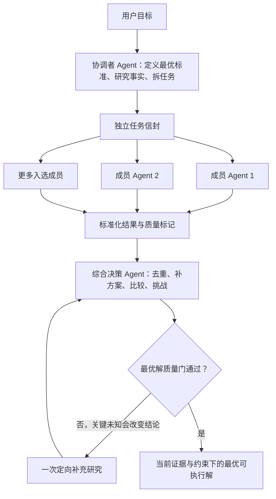

# tianya-skills 运行架构拆解

## 来源与审查

- 仓库：https://github.com/momozi1996/tianya-skills
- 固定提交：`5c4c29e0540089e0502147aee45610e4b1634f50`
- 提交日期：`2026-05-07T23:50:11+08:00`
- 审查日期：`2026-06-09`
- 许可证：MIT
- 版本控制文件：25
- GitHub 页面审查时显示：9 stars、2 forks、6 commits；这些统计会变化，不作为架构质量依据。

未安装、未运行仓库脚本，也未导入其中的人格内容。

## 安全结论

- `install.sh` 会写入 `$HOME/.stepclaw/`、创建启动脚本和符号链接，属于中等执行风险。
- `test.sh` 会调用 Python 编译脚本并生成 `__pycache__`；仓库自身已包含一个 `.pyc` 文件。
- `team-orchestrator.py` 未发现联网、凭据读取或系统删除行为，但它是演示协调器，不应直接用于本董事会。
- 综合风险：中等；仅学习架构，不安装、不执行、不归档原包。

## 真实实现判断

仓库文档描述的架构是：

```text
用户目标 → 协调者 Agent → 并行成员 → 综合决策 Agent → 决策报告
```

这一分层值得采用，但固定提交中的 Python 实现仍是演示骨架：

- `_select_gods()` 默认返回全部 20 位成员，并未真正智能选人。
- `asyncio.gather()` 确实并发执行协程，但成员函数只生成模板字符串，没有调用独立 AI Agent。
- 共识、分歧、风险、行动方案和综合建议均为硬编码占位内容。
- 所有成员置信度固定为 `0.85`，平均置信度没有证据意义。
- 输出全部成员长意见，会造成上下文膨胀和多数幻觉。

## 董事会采用与修正

| 原架构思想 | 董事会采用方式 | 修正 |
| --- | --- | --- |
| 协调者理解问题并分发任务 | 独立的协调者 Agent 创建共享决策包和任务信封 | 按边际贡献选人，不默认全员 |
| 成员并行分析 | 成员输入隔离，支持真实或逻辑并行 | 首轮只读议事卡，无新增则 `PASS` |
| 综合决策 Agent 汇总输出 | 独立综合决策 Agent 去重、补方案、比较和挑战 | 不按票数汇总，不使用伪造置信度 |
| 多模式运行 | 快速、标准、广泛三种规模 | 深评与补充轮按不确定性触发 |
| 结构化报告 | 输出当前最优解、行动与回滚条件 | 默认不展示全员长意见 |

## 本地升级架构


